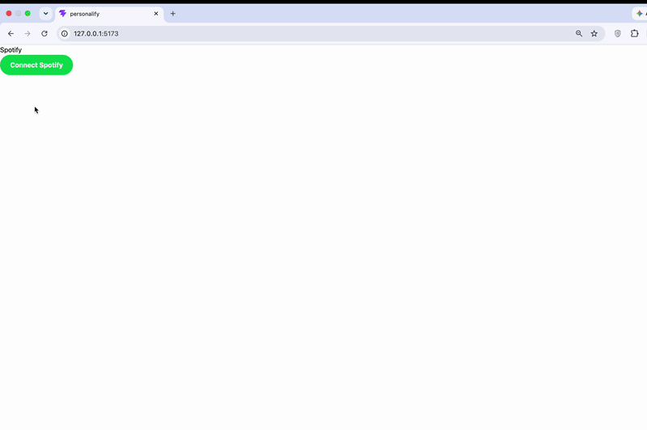

# Personalify 🎧

**What does your Spotify say about you?**
Personalify connects to your Spotify account, analyzes your top tracks, and turns your listening habits into a music personality, shown on a vinyl-themed result card designed for phones.



> **Note:** This app runs in Spotify's Development Mode, so only allowlisted accounts can log in. The demo above shows the full flow.

---

## Features

- **Spotify login with OAuth 2.0 PKCE**, written from scratch without an SDK (code verifier, SHA-256 challenge, Base64URL encoding, token exchange)
- **Personality algorithm** that scores your listening on two axes and maps you to one of four types, plus a modifier
- **"Liner notes" stats**, showing your real numbers on the card, styled like the back of a record sleeve
- **Session caching**, so data is fetched once and reloads read from `sessionStorage` instead of calling the API again
- **Status-aware error handling**: an expired token (`401`) sends you back to log in, while rate limits (`429`) and other errors stop instead of looping
- **Mobile-first design**: one phone-width card that sits centered and framed on desktop

## How the personality works

Your top tracks are scored on two axes:

| Axis | What it measures | Cutoff |
| --- | --- | --- |
| **Era** | Average release year of your top tracks | 2020 or later counts as *new* |
| **Variety** | Unique artists ÷ total tracks | 0.6 or higher counts as *varied* |

```
                     NEW
                      │
   Aesthetic Recluse  │  The Sonic Socialite
                      │
 DEVOTED ─────────────┼───────────── VARIED
                      │
   The Anthem Keeper  │  Genreless Soul
                      │
                     OLD
```

The **modifier** comes from how you listen within your type: whether one artist dominates your list (5+ appearances), whether most of your tracks come from full albums or from singles.

## The story: building on an API that kept changing

This project's algorithm was redesigned **three times**, because the data it depended on stopped being available to my app:

1. **v1: audio features.** The first design mapped energy and mood (Spotify's `audio-features` endpoint) to personality quadrants. The endpoint returned `403` for my app, so I redesigned the algorithm.
2. **v2: popularity and genres.** The second design scored mainstream-vs-obscure taste and genre diversity. During testing, every user landed on the same type. Debugging showed that track `popularity` and artist `genres` were **not present** in the API responses my app received, so every score was `0` or `NaN`.
3. **v3: release dates and artist variety (current).** I inspected the actual response shape with `Object.keys(...)` and rebuilt the algorithm on fields that *are* returned: `album.release_date`, `artists`, and `album.album_type`.

**What I took from it:** when your product depends on a third-party API, verify the real response data early, design around fields you can rely on, and make failures visible instead of silent.

## Tech stack

- **React** + **TypeScript**
- **Vite**
- **Tailwind CSS**
- **React Router**
- **Spotify Web API** (OAuth 2.0 Authorization Code with PKCE)

## Project structure

```
src/
├── auth.ts          # PKCE login flow + code-for-token exchange
├── spotify.ts       # API calls: profile, top tracks, top artists
├── personality.ts   # Scoring functions + type/modifier logic
├── LandingPage.tsx  # "Connect Spotify" screen
├── Callback.tsx     # Handles Spotify's redirect, saves the token
├── Result.tsx       # Fetching, caching, error handling, result card
└── App.tsx          # Routes
```

## Run it locally

1. **Clone and install**
   ```bash
   git clone https://github.com/clxrie/personalify.git
   cd personalify
   npm install
   ```

2. **Create a Spotify app** in the [Spotify Developer Dashboard](https://developer.spotify.com/dashboard)
   - Add the redirect URI: `http://127.0.0.1:5173/callback`
   - Under **User Management**, add the Spotify account(s) you'll log in with
   - Copy your **Client ID**

3. **Add your Client ID** in `src/auth.ts` (used in both `loginWithSpotify` and `exchangeCodeForToken`).
   PKCE doesn't use a client secret, so the Client ID isn't sensitive.

4. **Start the dev server**
   ```bash
   npm run dev
   ```
   Open `http://127.0.0.1:5173`. Use `127.0.0.1` rather than `localhost`, so it matches the redirect URI.

## Roadmap

- [ ] Save the result card as an image for sharing
- [ ] Shareable result links backed by a database (Supabase / PostgreSQL)
- [ ] Friendly on-screen messages for rate limits and other errors
- [ ] Make the decorative player controls interactive (spinning vinyl)

## Author

Built by **Komal** · [GitHub @clxrie](https://github.com/clxrie)